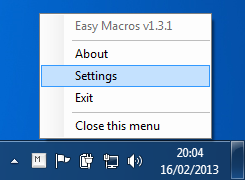
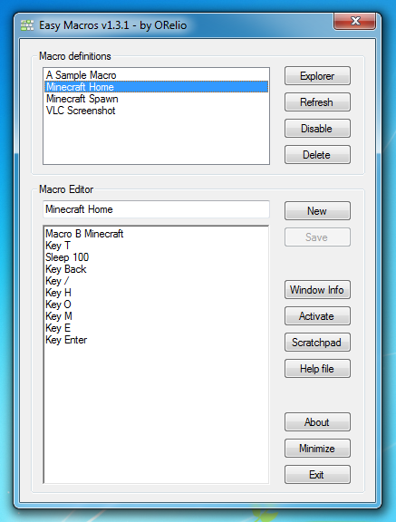

# Easy Macros

Easy Macros is a free software allowing to easily define macros for your games and applications,
without the need of acquiring sophisticated gaming hardware.

## Overview

This portable software runs in background, located in the notification area of the taskbar:

A built-in GUI allows managing macros:

## How it works

Easy Macros globally captures user input using the
[UserActivityMonitor DLL](http://www.codeproject.com/Articles/7294/Processing-Global-Mouse-and-Keyboard-Hooks-in-C)
by George Mamaladze. When a macro is triggered, user activity is simulated using the Windows API, most notably with
[keybd_event](https://msdn.microsoft.com/en-us/library/windows/desktop/ms646304(v=vs.85).aspx) and
[mouse_event](https://msdn.microsoft.com/en-us/library/windows/desktop/ms646260(v=vs.85).aspx) functions.

## User Manual

See [User Manual](UserManual/Readme-En.txt) to learn how to create a macro.

## License

Easy Macros is provided under
[CDDL-1.0](http://opensource.org/licenses/CDDL-1.0)
([Why?](http://qstuff.blogspot.fr/2007/04/why-cddl.html)).

Basically, you can use it or its source for any project, free or commercial, but if you improve it or fix issues,
the license requires you to contribute back by submitting a pull request with your improved version of the code.
Also, credit must be given to the original project, and license notices may not be removed from the code.
